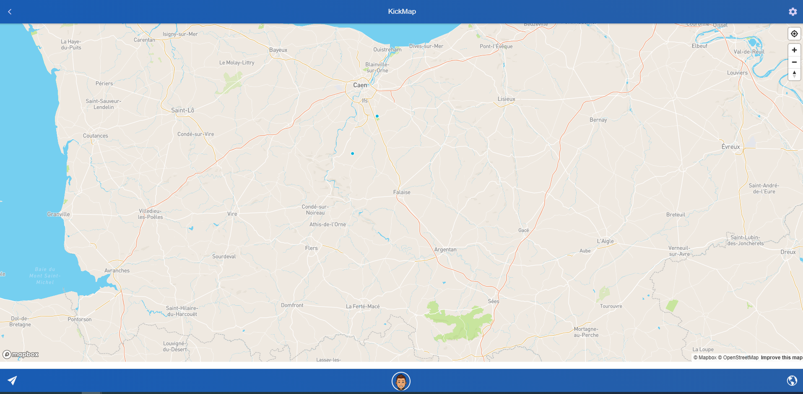

# mapComponent
A map component from an ionic project that I'm building

You cant compile the code as its part of a ionic/angular project but you can get the flow of it.
It's been made with mapbox and more functionalities will be added soon.

